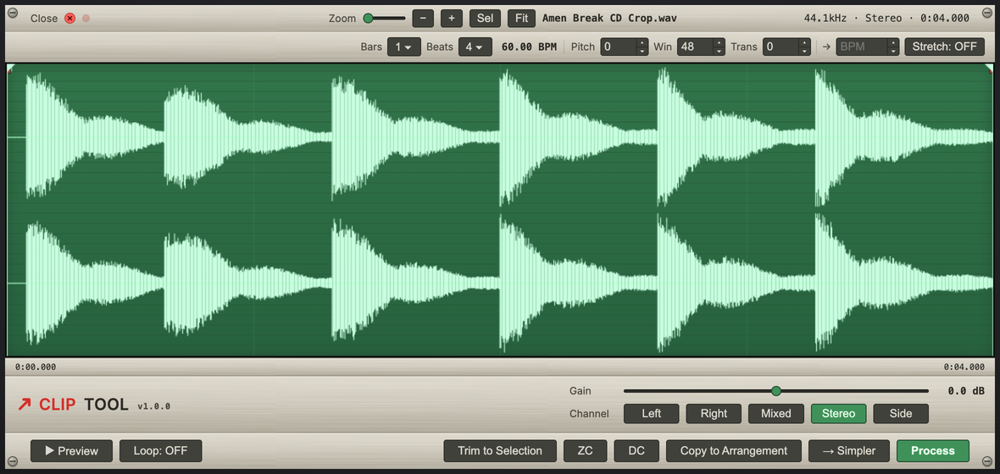
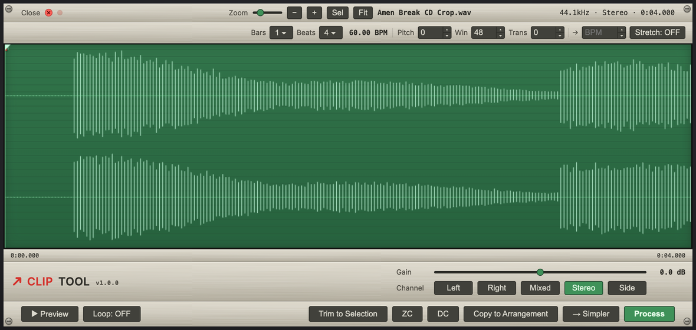
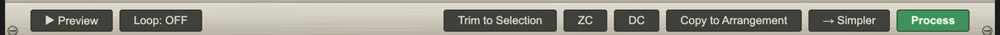
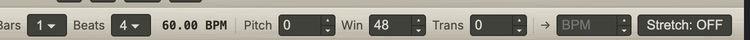
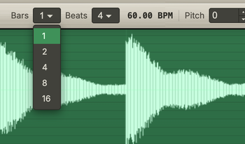
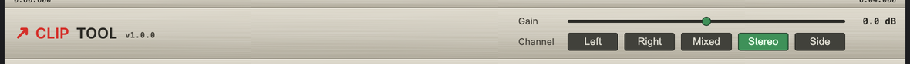

# Clip Tool

> A free audio clip editor that lives inside Ableton Live 12. Right-click a clip
> to edit the actual audio — trim, clean up, fade, pitch, time-stretch, fold to
> mono or fire it into a Simpler — and see and hear every change on the waveform
> before you commit it, without ever leaving Live.

Made by [Danny Wincott](https://github.com/fortymileswest)

[](https://github.com/fortymileswest/clip-tool/releases)
[](https://github.com/fortymileswest/clip-tool/releases/latest)
[](LICENSE)



Clip Tool never touches your original sample. Every edit is written to a fresh
file in your project's `Samples/Imported/` folder, so you can always get back
to where you started.

## What it's for

Live's audio effects are *live*: they sit on the channel, you can't see them on
the clip's waveform, and to make them permanent you have to bounce or render the
track out. Clip Tool works the other way round. It edits the actual audio in your
clip — trim, clean up, fade, fold to mono, pitch and time-stretch — and bakes the
result into a new sample you can see and hear, so you're never guessing what a
"live" effect will print.

It also closes a real gap. Sampler prep — removing DC offset, trimming on
zero-crossings, fades, a loop-safe time-stretch, and folding stereo down to mono
(which Live still has no built-in way to do) — normally means bouncing the track
out and hoping for the best. Clip Tool does all of it in place, on the clip,
turning a rough chop into something playable without leaving Live.

## Features



**Editing**

- **Sample-accurate zoom** — scale the waveform from the whole clip all the way
  down to individual samples (slider, −/+, **Sel** to zoom to the selection,
  **Fit**), so you can place trims, fades and the playhead on the exact sample
  for detailed editing.
- Click and drag to select, click to drop the playhead, drag the trim handles.
- **Trim to Selection**, which is non-destructive and keeps your channel, fade,
  gain and stretch settings.
- **Gain** from −18 to +18 dB.
- **Channel** modes: Stereo, Left, Right, Mixed (mono sum) and Side.
- **DC** to remove DC offset.
- **ZC** to snap edit points to zero-crossings so they don't click.
- **Fades** in and out with Linear, Exponential, Logarithmic or S-curve shapes
  (right-click), with draggable length and a mid-curve bend handle.
- A **Loop** region with its own handles and an on/off toggle.
- A pitch-preserving, loop-seamless **time-stretch** to a target BPM.
- **Pitch** shifting in semitones, with grain **Window** and **Transient**
  controls for tuning the character.

> **A note on the stretch and pitch.** These run on my own bespoke algorithm,
> and it's very much a work in progress. Right now it's a dirty, lo-fi stretch
> rather than a clean, transparent one. That isn't always a downside: it's great
> for grit, texture and happy accidents, and it can throw up some genuinely
> interesting sounds. I'll keep working on it, so expect it to get cleaner over
> time, and lean into the character in the meantime.

**Analysis**

- **Key and scale detection** in the header. A chromagram is built from FFT
  frames and correlated against the Krumhansl-Schmuckler major and minor
  profiles, so the clip is read as, say, `C major` or `A minor` — handy for
  matching samples to a track or spotting what you're working with at a glance.
- Tempo detection in the header.
- A beat grid driven by the detected tempo, or by the Bars and Beats you set, so
  edits line up musically.

**Output** (all of these apply your gain, fade, stretch, channel and DC settings)

- **Process** replaces the clip in place.
- **Copy to Arrangement** drops a new clip just after the original.
- **→ Simpler** builds a new MIDI track with a Simpler loaded and ready to play.
- **Rename** the rendered sample by right-clicking the filename.



**Keyboard and mouse**

The preview plays exactly what you'll render, with a moving playhead and live
gain.

Keyboard:

| Key | Action |
| --- | --- |
| `Space` | Play / stop the preview |
| `←` | Jump to the start of the selection |
| `→` | Jump to the end of the selection |
| `Esc` | Close the editor |
| `Enter` | Commit an inline rename (while editing the filename) |

Mouse:

- **Right-click inside the selection** for the loop menu: **Loop selection** sets
  the loop to your current selection (and turns it on), and **Clear selection**
  resets the selection to the whole clip.
- **Right-click an existing loop region** to also get **Clear loop**, which
  removes the loop and switches it off.
- **Right-click a fade region** to choose its curve shape (Linear, Exponential,
  Logarithmic or S-curve) or clear the fade.
- **Right-click the filename** to rename your new sample inline — the name you
  type is used for the rendered file and the clip Live creates. Press `Enter` to
  commit or `Esc` to cancel.

## Install (no dev tools needed)

> Requires Ableton Live 12 with Extensions support (currently the Live 12 beta).

1. Download **`clip-tool.ablx`** from the [Releases](../../releases) page.
2. In Live, open **Preferences → Extensions**.
3. Drag the `clip-tool.ablx` file onto the panel.
4. Restart Live if it doesn't show up straight away (Live loads extensions at
   startup).
5. Right-click any audio clip and choose **Clip Tool**.

If nothing happens on install, check that **Developer Mode** is off in
Preferences → Extensions, and if you run a lot of extensions, try turning some
off temporarily (the Live 12 beta can choke when loading many at once).

## How to use

1. Drop an audio clip onto a track, or pick one already in your Set.
2. **Right-click the clip and choose `Clip Tool`.** The editor opens on it.
3. Make your edits (see below).
4. Pick an output: **Process**, **Copy to Arrangement** or **→ Simpler**.

The original sample is left alone. The result lands in
`<your project>/Samples/Imported/`.

Tempo, pitch and time-stretch controls sit along the top, with the detected
tempo, Bars and Beats, pitch and grain settings, and the target BPM:



Bars and Beats are app-styled dropdowns, and the number fields have their own up
and down steppers:



### Folding stereo to mono



With a stereo clip open, use the **Channel** row:

| Mode | What it does | Reach for it when |
|------|--------------|-------------------|
| **Stereo** | Keeps both channels | the stereo image matters and there's no phase trouble |
| **Mixed** | Mono sum, (L+R)/2 | the channels are in phase, the natural fold-down |
| **Left** / **Right** | One channel only | summing cancels (thin snare, missing bass), so audition both and keep the better one |
| **Side** | The stereo difference, (L−R)/2 | you want only what differs between the channels, like room or cymbals |

Preview each one with `Space`, keep whichever sounds fullest, then **Process** or
send it **→ Simpler**. For breakbeats this single step routinely saves a chop
that would otherwise fall apart in mono.

## Tips and use cases

- **Breakbeats and drum hits:** fold to the mono channel that keeps the transient
  and the low end, snap the edges with **ZC**, **Trim** tight, then send it
  **→ Simpler**.
- **Phase-cancelling stereo:** if **Mixed** sounds thin, the channels are out of
  phase, so switch to **Left** or **Right**. **Side** is handy for pulling out
  room and width.
- **Old or vinyl samples:** run **DC** to recentre a lopsided waveform. You'll
  get headroom back and stop loops from clicking.
- **Seamless loops:** set a **Loop** region, snap with **ZC**, add short
  **fades**, and the cyclic stretch keeps the seam clean at your target BPM.
- **Matching a chop to your track:** let the beat grid read the tempo, set the
  target BPM, and stretch. The pitch stays put.
- **Tuning a sample:** **Pitch** shifts in semitones without changing the length.
  Raise **Window** for a smoother, cleaner sound, drop it for more grain, and use
  **Transient** to keep the hits punchy.
- **Lean into the lo-fi stretch:** the stretch and pitch are deliberately rough
  for now (see the note above), so push them for character rather than for clean
  results. Extreme ratios and small grain windows are a good way to stumble onto
  unexpected textures.

## Build from source

The prebuilt `.ablx` in the [Releases](../../releases) means you don't need any
of this to use Clip Tool. To build it yourself:

```bash
npm install
npm run build      # type-check and bundle to dist/
npm run package    # build and produce clip-tool.ablx
npm test           # run the test suite
```

Building needs the **Ableton Extensions SDK** (a beta supplied by Ableton). It
isn't on npm and can't be redistributed here, so drop your own copy of the two
`.tgz` files into `vendor/` (see [`vendor/README.md`](vendor/README.md)) before
running `npm install`.

To run it live against Live's Extension Host, create a `.env` with the host path:

```bash
# macOS
EXTENSION_HOST_PATH=/Applications/Ableton Live 12 Beta.app/Contents/Helpers/ExtensionHost/ExtensionHostNodeModule.node
```

**Layout**

- `src/extension.ts` runs in Live's Extension Host: it registers the right-click
  action, renders the clip to a temporary WAV, shows the editor, and writes the
  result back.
- `src/processor.ts`, `src/fades.ts` and `src/timestretch.ts` hold the DSP,
  compiled once for Node and once as browser globals so the preview and the final
  render use the same maths.
- `src/webview/` is the editor itself (`index.html`, `waveform.js`,
  `controls.js`), plain HTML, CSS and JavaScript with no framework.

## Contributing

Bug reports and ideas are welcome through Issues. Fork it and adapt it for your
own work as much as you like. The original repository isn't open for direct
changes, but if you'd like something added, open a Pull Request and I'll take a
look.

## Licence

[MIT](LICENSE), so it's free to use, change and share. © 2026 Danny Wincott.
